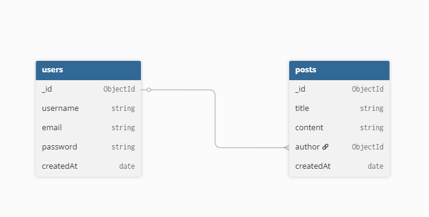
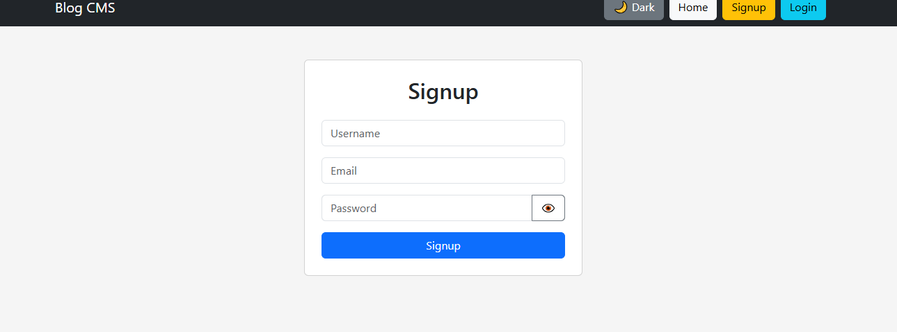
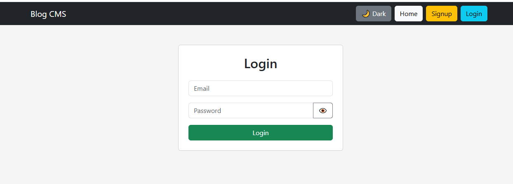
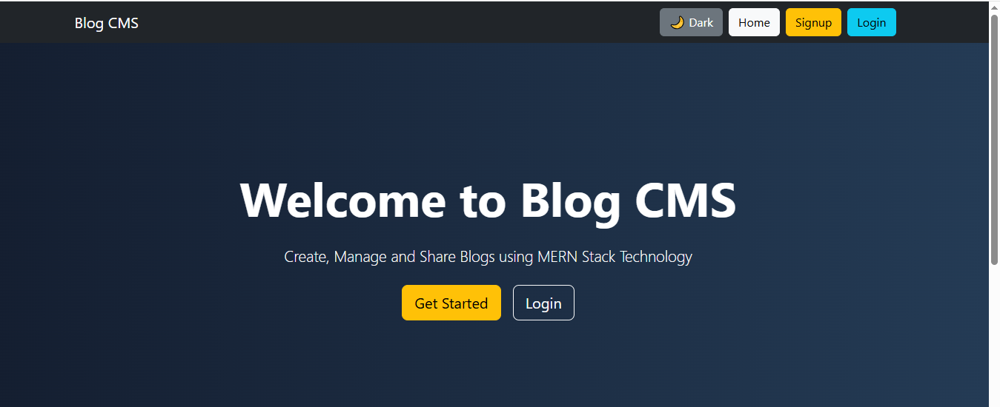

BLOG/CMS SYSTEM(PART-1)

  GITHUB REPOSITORY LINK:
  FRONTEND VERCEL LINK:

1.DATABASE SCHEMA DIAGRAM:
             

2.WORKING AUTHENTICATION ENDPOINTS:
     Endpoint            Status 

   POST /signup          ✅      
   POST /login           ✅      
 JWT Authentication      ✅      
 Protected Routes        ✅      

 3.FRONTEND AUTHENTICATION PAGE:
     Signup page: 
     Login page: 
     Home page: 
    
4.NAVIGATION STRUCTURE:
   Navbar
     ├── Home
     ├── Signup
     ├── Login
     ├── Posts
     └── Logout

   